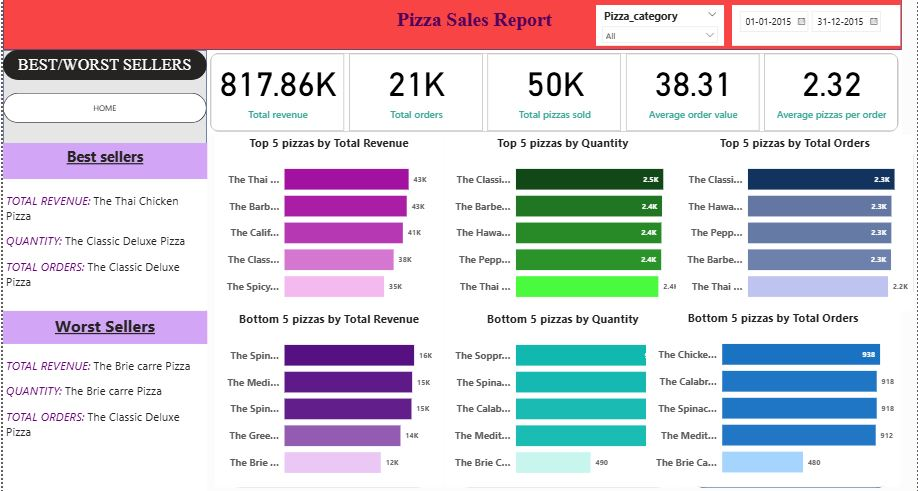

# Pizza_sales
It is created to analyse the sales report of a pizza shop.
# 🍕 Pizza Sales Analysis

## 📊 Project Overview

This project analyzes pizza sales data using SQL and Power BI to understand sales performance, customer ordering patterns, and the performance of individual pizza products.

The analysis focuses on key business metrics such as total revenue, total orders, total pizzas sold, average order value, and average pizzas per order.

The project also identifies the best and worst performing pizzas based on revenue, quantity sold, and number of orders.

---

## 🎯 Business Objectives

The main objectives of this project are:

- Analyze overall pizza sales performance
- Calculate key sales KPIs
- Understand daily and monthly order trends
- Analyze sales performance by pizza category
- Identify the top-performing pizzas
- Identify the lowest-performing pizzas
- Compare pizzas based on revenue, quantity sold, and total orders
- Provide insights that can help improve product and sales performance

---

## 🛠️ Tools & Technologies

- **SQL** – Data analysis and querying
- **Power BI** – Data visualization and dashboard development
- **Power BI Desktop** – Dashboard creation
- **GitHub** – Project documentation and version control

---

## 📌 Key KPIs

The Power BI dashboard provides the following key metrics:

| KPI | Value |
|---|---:|
| Total Revenue | 817.86K |
| Total Orders | 21K |
| Total Pizzas Sold | 50K |
| Average Order Value | 38.31 |
| Average Pizzas per Order | 2.32 |

---

## 📈 Dashboard

The Power BI dashboard provides an overview of pizza sales performance, including:

- Total Revenue
- Total Orders
- Total Pizzas Sold
- Average Order Value
- Average Pizzas per Order
- Top 5 pizzas by Revenue
- Top 5 pizzas by Quantity
- Top 5 pizzas by Total Orders
- Bottom 5 pizzas by Revenue
- Bottom 5 pizzas by Quantity
- Bottom 5 pizzas by Total Orders
- Best Sellers
- Worst Sellers
- Pizza Category filter
- Date range filter

### Dashboard Preview

---

## 🔍 SQL Analysis

SQL was used to calculate the major business metrics and analyze pizza performance.

The analysis includes:

### Overall Sales KPIs

- Total Revenue
- Average Order Value
- Total Pizzas Sold
- Total Orders
- Average Pizzas per Order

### Sales Trends

- Daily order trends
- Monthly order trends

### Pizza Category Analysis

- Percentage of sales by pizza category

### Product Performance

- Top 5 pizzas by Revenue
- Bottom 5 pizzas by Revenue
- Top 5 pizzas by Total Orders
- Bottom 5 pizzas by Total Orders
- Top 5 pizzas by Quantity Sold
- Bottom 5 pizzas by Quantity Sold

---

## ⭐ Key Insights

The dashboard highlights the following:

- The business generated approximately **817.86K in total revenue**.
- Approximately **21K orders** were placed.
- Around **50K pizzas** were sold.
- The average order value was approximately **38.31**.
- Customers purchased an average of **2.32 pizzas per order**.
- **The Thai Chicken Pizza** was the highest-revenue pizza shown in the dashboard.
- **The Classic Deluxe Pizza** was among the strongest performers based on quantity and total orders.
- **The Brie Carre Pizza** was identified as one of the weakest-performing pizzas based on revenue and quantity.

---

## 💡 Business Recommendations

Based on the analysis, the following actions could be considered:

- Promote high-performing pizzas to maximize revenue.
- Analyze why low-performing pizzas have lower sales.
- Consider promotional offers for underperforming products.
- Use pizza category performance to optimize the product mix.
- Monitor monthly and daily sales trends to identify periods of high and low demand.
- Focus marketing efforts on products with strong customer demand.

---

## 📂 Project Files

| File | Description |
|---|---|
| `pizza_sales_dashboard.pbix` | Power BI dashboard |
| `pizza_sales_script.sql` | SQL queries used for analysis |
| `pizza_sales_dashboard1.JPG` | Power BI dashboard screenshot |
| `pizza_sales_dashboard2.JPG` | Power BI dashboard screenshot |

---

## 👩‍💻 Project Author

**Rajeswari**

This project was created as part of my data analytics portfolio to demonstrate SQL analysis and Power BI dashboard development.
